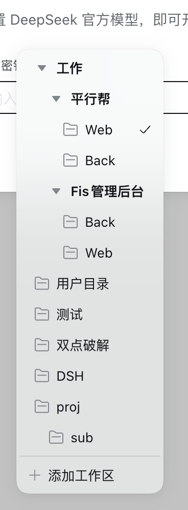

# dsh-better-workspace

[](https://awesome-dsh-plugin.com)

简体中文 | [English](README_EN.md)

> 给 [DeepSeek Harness (DSH)](https://www.npmjs.com/package/@deepseek-ai/dsh) 的侧边栏「工作区」列表装上一套**两层文件夹系统**——**磁盘层**按目录路径嵌套(官方 workspace-tree 语义:子目录里的工作区挂在父目录工作区之下),**名称层**吃工作区名字里的 `/`(「网页前端」「网页后端」归到同一个 `web` 分组),两层正交组合。

```
磁盘层(目录路径,自动嵌套)        名称层(名字里的 /,虚拟分组)
~/projects/                        web/
├─ web/        ← 工作区(目录)     ├─ 前端     ← 工作区「web/前端」
│  └─ api/     ← 子目录工作区      └─ 后端     ← 工作区「web/后端」
└─ docs/       ← 同级工作区
```

## 功能与效果

<table>
<tr>
<td align="center" width="58%"></td>
<td valign="top"><b>层级树</b><br/>工作区名称里的 / 即分组:web/前端、web/后端归到同一个 web 分组下,支持任意多级;不带 / 的工作区照常显示在根层。重命名工作区后树<b>即时重排</b>——分组只是名字的投影,没有第二份需要同步的数据。</td>
</tr>
</table>

### 添加工作区:官方目录流

点「添加工作区」走的是 **DSH 官方的目录拾取流**(v0.12.0 起):webserver 只绑本机 loopback 且有显示会话时,弹出宿主桌面上的**原生选择器**;绑到 `0.0.0.0`(局域网访问)、SSH 转发或宿主没有可用显示会话时,自动切换为官方**应用内目录浏览器**(多栏目录、从根开始的面包屑、可编辑路径、行内新建文件夹、隐藏文件开关)——这正是 0.11.x 自绘浏览器打磨的场景,官方补齐后整体让位。选完目录即创建工作区并开始一个新会话,与官方浏览器行为一致;对话空态页的「添加工作区」用的是**同一套官方占用者**,只是入口由本插件渲染(见下)。

分组不靠添加时弹窗——**改名即归组**:新建后重命名工作区(名称里的 `/` 就是分组),或直接拖拽进分组行。

### 分组:名字的投影

分组由工作区名称里的 `/` 自然派生,没有第二份需要同步的数据——右键分组行可**重命名分组**(批量改写组内所有工作区名称的前缀),分组树即时重排;根分组 = 名称不带 `/` 的工作区。

### 会话也吃这套规则

工作区里的会话名称同样用 `/` 分层(如 `测试1/两个插件维护`)。会话分组用**次级配色且无文件夹图标**渲染,和工作区文件夹一眼可辨;会话分组可整组重命名(批量改写成员标题)。

**重启后标题不回退**:DSH 重启后的冷列表只为命中投影缓存的会话携带标题——分叉出的会话与从未写过检查点的会话会暂时回退成「工作区名」显示,真实的标题其实还在会话日志里。本插件把每个会话**最近一次的真实标题**持久化在浏览器里(带防抖的本地缓存,变更合并整写一次),回退窗口内直接用记忆标题渲染,`/` 分级分组照常成立;打开会话后官方数据到位即自动纠正。

**跨端手动同步(Web ↔ 桌面客户端)**:外观自定义、默认外观与开关默认保存在各设备自己的浏览器里;设置卡片新增「跨端同步」区——Web 上点「从客户端获取」、客户端上点「从 Web 获取」,可选**覆盖本设备**或**合并两端**(并集保留各自独有项),另一端的数据经宿主设置存储(~/.dsh/settings.yaml,两端共享)送达;旁边有「发送本设备数据」按钮,旧版本的历史数据首次同步推一次即可,之后每次修改都会自动写入宿主、对端随手可取。折叠状态仍保持每端独立。

<table>
<tr>
<td align="center" width="58%"></td>
<td valign="top"><b>外观自定义</b><br/>右键任意一层(工作区分组 / 工作区 / 会话 / 会话分组)→「自定义外观」:颜色(预设色板 + 取色器 + RGB)、发光强度(0..14 拖动条,只作用于文字)、字体粗细、字体阴影开关、**字体描边**(开关 + 0.5–4px 粗细,**默认开启**;描边颜色默认**灰**,可改黑 / 白 / 任意取色,或选「自动」按字体颜色取反差色——浅色字配黑边、深色字配白边,并跟随主题与背景插件的界面明暗)、图标(与 dsh 图标库同族的 69 个,工作区与工作区分组专属),底部带实时预览。清除自定义一键复原。</td>
</tr>
<tr>
<td align="center" width="58%"></td>
<td valign="top"><b>改完即见</b><br/>颜色、文字发光、字体粗细、阴影与图标按行应用,和展开状态一起经 dsh 客户端 store 持久化在当前浏览器。</td>
</tr>
</table>

<table>
<tr>
<td align="center" width="58%"></td>
<td valign="top"><b>右键菜单</b><br/>操作都收进右键:工作区行——重命名 / 删除 / 分叉 / 归档 / 自定义外观;工作区分组行——重命名分组(同步更新组内所有工作区名称)/ 自定义外观;会话与会话分组行——重命名 / 分叉 / 归档 / 自定义外观。</td>
</tr>
</table>

<table>
<tr>
<td align="center" width="58%"></td>
<td valign="top"><b>设置卡片</b><br/>设置 → 插件 → 插件配置 里新增「更好的工作区」卡片(官方折叠卡片样式),提供<b>单链分组合并</b>开关(如 测试层1 下只有 AI交易 一个工作区时,合并显示为一行 测试层1/AI交易)与<b>状态呼吸灯</b>开关(被折叠藏起的状态灯沿层级向外冒泡呼吸发光,默认开);另有<b>默认外观</b>区——颜色 / 发光 / 字体粗细 / 字体阴影 / 字体描边开关 / 描边粗细一次配好,没有单独自定义过的行全部继承(只有描边默认开,其余同「无自定义」),并随宿主设置存储跨端同步。展开状态与外观自定义经 dsh 客户端 store 持久化在当前浏览器。</td>
</tr>
</table>

### 其余亮点

- **文件夹式收起**:点工作区行 = 收起/展开该工作区的全部会话(收起后行上保留会话数角标);会话分组同样可收起;搜索时自动全部展开。
- **拖拽还原原版能力**:工作区行可拖拽——拖到另一工作区行上/下半即调整顺序(写回宿主 registry 序),拖到分组行则移动进该分组(改写名称前缀);会话行可拖拽——同组内拖到另一会话上/下即调整顺序,拖到**别组的会话行**会把名字前缀改写到那个组(拖到根层的行 = 移出分组),拖到会话子分组行即移动进该分组,拖到**自己的工作区行**或**树里任何组外的地方**(含空白区域)同样移出分组 —— 拖拽期间工作区行整行高亮、树底部有一条淡虚线提示这个出口;带分组前缀的会话行右键还多一项「移出分组」。显示顺序 = 宿主手动序,拖拽结果立即生效。**磁盘层是文件系统事实,不随拖拽改变**:跨磁盘层的放置只重组名称分组(工作区落回自身磁盘层的末尾),同层放置才走锚点序。拖拽工作区期间,单链合并显示的行(如 工作/A)临时展开回文件夹树——路径里的每一级都是可投放的分组行,松手后自动合并回去。
- **不丢原生能力**:会话行(打开/重命名/分叉/归档)、每工作区「新会话」(点 + 总是先展开该工作区,让新会话立刻可见)、当前会话高亮、官方状态灯(蓝色运行环 / 琥珀待交互 / 绿色完成提醒)、**状态呼吸灯**(折叠藏起的状态灯向外冒泡:工作区/分组行图标按状态色呼吸发光——琥珀待交互/绿完成,自定义过发光的标题一起呼吸;运行中只在会话行本层蓝色呼吸,不外渗;可在设置关闭)、**活跃定时任务角标**(有活动 Schedule 的会话显示闹钟图标;v0.23.0 起直接渲染官方 `sidebar.session.row.leading` 座位的占用者,与官方行同源)、未分组会话兜底、界面文案跟随 DSH 的语言设置(内置 21 种语言,含简繁中文)。
- **新增项自动配色 + 图标(v0.24.0,默认关闭)**:设置卡里一个开关,打开后**新创建的会话**自动分到一个内置色、**新工作区**再额外分到一个图标,懒得逐个设置的人直接开箱即用。颜色来自**定死的 13 色调色板**,按「洗牌袋 + 近期回避窗口」抽取——一轮之内绝不重复,跨轮也不会立刻撞上刚出过的 3 个,连续新建几项肉眼可辨。可读性口径(说准确些):每个色在浅色与深色背景下的对比度**都 ≥3.0**(WCAG 图形/大字号阈值);**正文级 AA 需要 4.5,本池未达**——与插件里既有手动色板同档,并且已经排除了原色板中最淡的 5 个(白底仅 2.0~2.8)。单一固定色值不可能同时满足纯白与近黑两个极端背景,这是数学约束。**只影响打开开关之后新建的项**:你手动设置过外观的行永不被覆盖,关闭开关也不会回收已分配的样式,同一项不会被二次随机。图标从既有图标候选集里取、按宿主实际导出过滤;**图标只给工作区**——会话行的那个位置是官方状态灯与日程角标,没有图标位。
- **官方新语义与快捷键都接上(v0.23.0,对齐 dsh 0.1.7-rc.2)**:① 归档筛选是官方新版三态直选(**隐藏已归档** / **全部对话(显示已归档)** / **仅显示已归档**);选「仅显示已归档」时**没有归档会话的工作区整行隐藏**,空列表显示「暂无已归档会话」+「查看其他会话」一键回退;② 官方快捷键 **⌥⌘K 搜索 / ⌥⌘O 添加工作区 / ⌥⌘N 新会话**(桌面端为 ⌘K / ⌘O / ⌘N)在本插件的自绘侧栏里**真的生效**——搜索键打开并聚焦本插件的搜索框、添加键走同一个官方目录流(原生宿主弹系统选择器,browse 宿主弹应用内入口提示),按钮文案还会带上宿主当前的键位;③ 首次使用的工作区显示为本地化的「默认工作区」,不再露出磁盘目录名。
- **URL/斜杠标题不拆层**:宿主自动生成的会话标题落地时若含 `/`(如复述了 URL),整串自动包上 `“”` 原样显示,绝不解析成层级——只对本次启动后**新建的会话**生效,并等命名稳定(约 20 秒,让原生 AI 命名先落地)才处理;存量会话与你手动命名的 `/` 分组标题永不被改动。引号内(含手动添加)的 `/` 永不切分,孤立引号只当普通字符;无引号但含 URL 的旧标题也有平铺兜底。
- **新会话页的工作区选择器 = 侧栏那棵树(v0.22.0)**:会话空态页「工作区」按钮的弹层原本是官方的一层平铺标题列表(连磁盘目录嵌套都没有);本插件接管该座位后,弹层绘制与侧栏**同一棵**树——磁盘目录嵌套、「/」名称分组三态、单链合并全部读同一个视图 store,所以侧栏的视图选项一改,**这边立刻跟着变**;当前工作区带勾选标记,分组行可开合(选择器内本地记忆,默认全展开),标题按侧栏的层级叶子显示。底部「添加工作区」仍由**官方目录拾取占用者**承载(原生选择器 / 官方应用内浏览器),不是仿制品。

<table>
<tr>
<td align="center" width="34%"></td>
<td valign="top"><b>同一棵树,两个入口</b><br/>左图是「新会话」页工作区按钮的弹层:分组行带 chevron(可开合)、工作区行带文件夹图标与层级缩进、当前工作区带勾选,底部是官方目录流驱动的「添加工作区」。它和左侧栏共用同一份视图状态——在侧栏把「工作区分组」从「磁盘 + 名称」换成「磁盘目录」或「仅名称」,这里的分组结构立即跟着变,不需要刷新,也没有第二份需要同步的数据。</td>
</tr>
</table>

## 安装

```bash
dsh plugin --profile web add dsh-better-workspace   # npm 公开包
# 源码与 Release: https://github.com/KannaKuron/dsh-better-workspace
```

纯 JS、零构建、零 npm 依赖(只依赖 dsh 客户端基线模块),安装不触发任何构建脚本。装完**重启 DSH** 即生效。

<details>
<summary>手动挂载(不用 CLI 时)</summary>

把包放进 profile 的 `node_modules` 后,在 profile 的 `cordis.patch.yml` 里加:

```yaml
- insert:
    - id: better-workspace
      name: 'dsh-better-workspace'
```

</details>

## 工作原理

DSH 的侧边栏浏览区是一个公开插槽 `sidebar.workspaces`(single),官方工作区浏览器是它的占用者;本插件以更低优先级注册同一插槽,**整区替换**为层级树版本。数据全部来自插槽标准注入(`useWorkspaces` / `useSessions` 快照钩子),动作(打开会话、重命名/删除工作区、归档等)也走注入的宿主动作——不碰任何私有 API。

「添加工作区」完全交给官方:官方组合占用者(原生选择器 / 应用内浏览器)承载全部拾取交互;本插件作为 owner 只负责选完目录后的创建与新会话。**两个 directoryFlow 子洞自 v0.16.0 起都不由本插件声明**——子洞声明是独占的,接管座位的一方永远拿不到 `renderSlot` 授权(相关事故见 CHANGELOG)。侧栏的添加动作因此改为直接驱动官方目录服务(native → 官方 OS 选择器;browse → 提示指向空态页),而**空态页的添加动作直接渲染官方占用者组件本身**:从 slot ledger 读出该洞的占用项(组件 + 它自己的注入面),由本插件补上 owner 对话(open / busy / onPicked / onCancel / onError)。原生与 browse 宿主各自保留出厂交互;ledger 读不到占用项时,少的只是「添加工作区」这一项,选择器照常工作。该机制 0.1.2+ 宿主即可用,升级先后都收敛。

会话空态页的工作区座位(`conversation.hero.workspace`)与侧栏同理:本插件以更低优先级注册同一座位,弹层换成侧栏同源的树;该座位**不声明任何子洞**,所以官方 picker entry 的所有权不受影响。

视图状态(分组折叠、会话展开)、外观自定义与插件设置都通过 dsh 客户端 store 持久化在浏览器本地(`dsh.betterWorkspace.view.v1`)。注意:该 store 的 hydration 是整值替换、不合并默认值——升级后如果遇到状态字段缺失,重启前的旧状态按旧结构保留,缺的键自动回退默认。

## 与 dsh-better-sidebar 的关系

同属 `dsh-better-*` 家族,但互不重叠:[dsh-better-sidebar](https://github.com/omdsh-dev/DSH-better-sidebar) 是**右侧**的 VSCode 式面板(资源管理器/终端/Git);本插件只接管**左侧**工作区列表。两者可同装。

## 版本兼容

- **dsh 0.1.6-alpha.1**:图标集与浏览器注入面都变了,本插件 **0.10.2 起自动适配**——图标网格只列本宿主真正导出的字形(退役的 `IconSendOutline16` 自动落到等价的 `IconSendOutline14`,已保存的旧选择不会变成空图标位),会话拖拽排序在宿主不再注入 `insertSessionBefore` 时改用浏览器本地顺序,**功能不丢**。升级 dsh 与升级插件谁先谁后都收敛。
- **dsh 0.1.6-alpha.2**:设置页重组——本插件 **0.12.0 起双座位**注册设置卡片(旧宿主的 设置→插件 卡片 + 新宿主 插件面板 bundle 页,按包名挂载);工作区树新增**磁盘目录嵌套层**(官方 workspace-tree 语义),添加工作区回归官方目录流(原生选择器 / 官方应用内浏览器)。
- **跨端**:web 与桌面共用同一套客户端资产;外观 / 开关可经设置卡片手动跨端同步,**折叠状态与会话本地序每端本地**(设计如此)。

## 限制与路线图

- 会话**跨工作区**拖拽仍被拒绝(会话归属工作区);同一工作区内的分组归属已随拖拽生效(v0.18.0:拖到别组的行改写前缀,拖到自己的工作区行移出分组,右键也有「移出分组」)。
- 搜索为本地标题过滤(两层扁平化后逐工作区匹配);宿主内容搜索(`session.search`)计划接回。
- flat(平铺)视图未接管,层级树即视图。侧栏切到「单列表 / 按工作区」时,新会话页的选择器退化为**一层完整标题**的工作区列表(仍可选,不再分组)。
- 新会话页选择器里的分组开合是**选择器本地状态**(默认全展开):它不写侧栏的折叠状态,免得选工作区时被侧栏的折叠挡住目标。

## 开发

```bash
npm test        # 冒烟测试:清单一致性 / 基线 require 白名单 / 21 门词典键集对齐 / 语法
npm pack        # 出 tarball 后可本地安装验证
```

本地验证:把 `npm pack` 产出的 tarball 装进 web profile 并手动挂载(见上),重启 DSH,验证:层级树渲染、添加工作区弹窗、重命名即时重排、新建分组、卸载后回到原浏览器。

## License

[MIT](./LICENSE)
