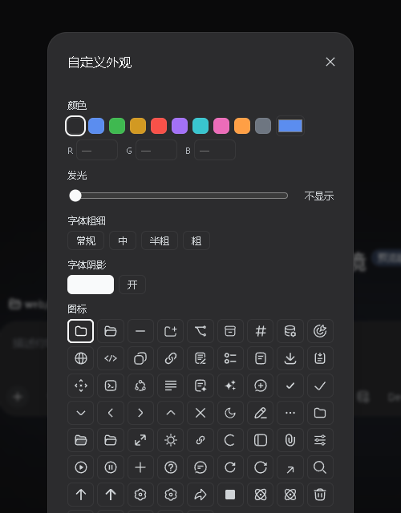
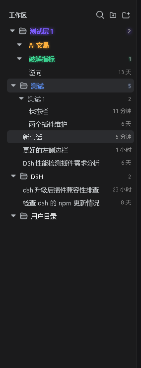
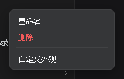

# dsh-better-workspace

> A **folder system** for the DeepSeek Harness (DSH) sidebar workspace list — a workspace is still one directory, but every `/` in its name becomes hierarchy, so `web/frontend` and `web/backend` group under one virtual `web` folder.

```
web/                 <- virtual folder (naming only, not a real directory)
|- frontend          <- workspace "web/frontend"
`- backend           <- workspace "web/backend"
```

## Features & preview

### Hierarchical tree

Every `/` in a workspace title creates a virtual folder: `web/frontend` and `web/backend` sit under one `web` group, arbitrarily deep; workspaces without a `/` stay at the root. Renaming a workspace re-derives the tree instantly — folders are a projection of names, there is no second source of truth.


### Add flow: pick a folder, then pick a group

After you pick a directory for a new workspace, a small dialog asks for the parent group — type one (`web`), pick an existing level from the datalist, or leave it empty for the root. The plugin creates the workspace and writes the prefix into its title, so it lands on the right branch of the tree.

### New-folder button

Create explicit empty folders (multi-level paths welcome) that persist in the browser until workspaces live inside them.

### Sessions follow the same rule

Session titles nest on `/` too (e.g. `test1/plugin maintenance`). Session groups render in a secondary color without a folder icon, so they are clearly distinct from workspace folders; a session group can be renamed as a whole (rewrites member titles).

### Appearance customization

Right-click any row (folder / workspace / session / session group) → Customize: color (swatches + picker + RGB), glow strength (0–14 slider, text only), font weight, font shadow, an icon grid (66 icons from the dsh primitives family, workspace & folder rows only), with a live preview at the bottom. Reset returns to default in one click.





### Context menu everywhere

Actions live in the right-click menu: workspace rows — rename / delete / fork / archive / customize; folder rows — rename group (updates all descendant workspaces) / delete empty group / customize; session & session-group rows — rename / fork / archive / customize.



### Settings card

Settings → Plugins → Configuration adds a “Better Workspaces” card (official accordion style) with a **single-child-chain merge** toggle (e.g. `level1` containing only `AI trade` renders as one row `level1/AI trade`); expansion state and styling persist via the dsh client store in the browser.


### More highlights

- **Folder-style collapse**: clicking a workspace row collapses/expands all of its sessions (the row keeps a session counter when collapsed); session groups collapse too; search force-expands everything.
- **Native drag restored**: drag a workspace row above/below another to reorder (writes back the host registry order) or onto a folder row to move it into that group; drag session rows to reorder within the same workspace or onto a session group to move. Display order = host manual order, drag results are visible immediately.
- **Native capabilities kept**: open/rename/fork/archive sessions, per-workspace new-session, current-session highlight, official status dots (blue running ring / amber pending / green done), ungrouped-session fallback, zh/en localization.
- **Conversation hero too**: the empty-state “Add workspace” menu uses the same picking interaction with the same group popup.

## Install

```bash
dsh plugin --profile web add dsh-better-workspace
```

Plain JavaScript, zero build, zero npm dependencies (dsh client baseline modules only). Restart DSH after installing.

## How it works

The sidebar browsing region is the public `sidebar.workspaces` slot; this plugin registers the same slot with a lower priority and replaces the shipped browser with the tree. All data flows through the slot’s standard snapshot hooks and injected host actions — no private APIs.

The add flow lands in the seam dsh designed for third parties: the two `directoryFlow` holes. The trigger, busy semantics, and error dialog stay official; this plugin owns everything between the trigger and the adopted path — exactly enough room for pick → group popup → create → prefixed rename.

View state (folder collapse, session expansion, explicit empty folders), custom styling and plugin settings persist browser-side via the dsh client store (`dsh.betterWorkspace.view.v1`).

## Relationship to dsh-better-sidebar

Same `dsh-better-*` family, zero overlap: [dsh-better-sidebar](https://github.com/omdsh-dev/DSH-better-sidebar) is the VSCode-like panel on the right; this plugin only takes over the left workspace list. They can be installed together.

## Limitations / roadmap

- A session dragged onto a session row **inside another group** only gets reordered in the flat list (its title group stays); drag onto the group row or rename to move it.
- Search is local title filtering; host content search (`session.search`) is planned.
- Explicit empty folders persist per-browser (roadmap: host-side folder registry + settings page).
- The flat view is not taken over; the hierarchical tree is the view.

## Develop

```bash
npm test        # smoke: manifest consistency / baseline require whitelist / dictionary alignment / syntax
npm pack        # tarball for local install verification
```

## License

[MIT](./LICENSE)
